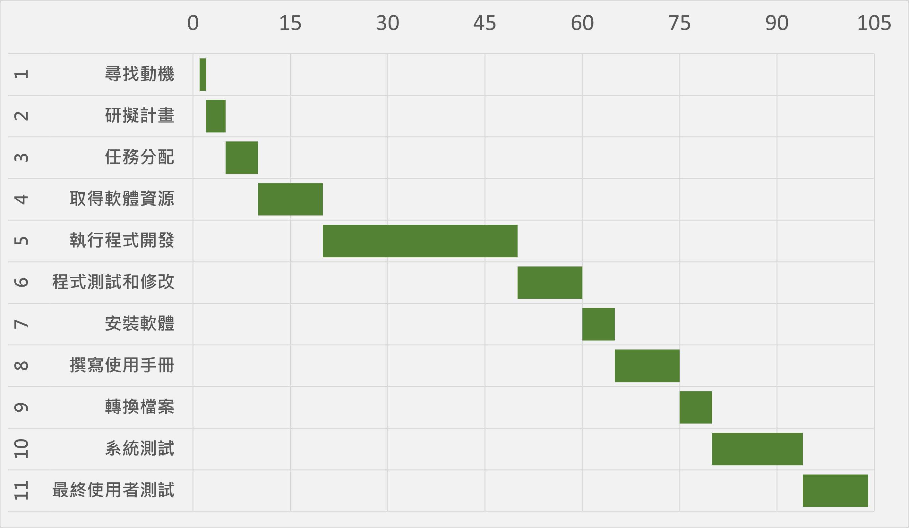
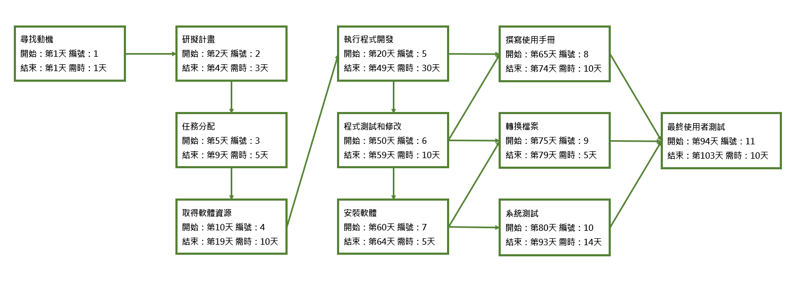

# Team12

 # 
 
|      任務   |     說明      |  需時(天) | 前置任務|人員|
|:-------------:|:-------------| :-----:|:-----:|:-----:|
|    1    |尋找動機 | 1 | - |全員 |
|    1    |研擬計畫 | 3 | 1 |顏淑君 |
|    2   |  任務分配    |   5 | 2 |全員 |
| 3|    取得軟體資源    |    10 |   3 |林雅婷 |
| 4 |   執行程式開發   |  30  | 4|全員 |
| 5|    程式測試和修改    |  10 |   5 |全員 |
| 6 |    安裝軟體    |    5|  6 |顏淑君|
| 7 |    撰寫使用手冊    |   10|   5、6 |林雅婷 |
| 8 |   轉換檔案    |    5 |   6、7 |全員 |
| 9 |    系統測試    |    14|   7 |全員 |
| 11 |    最終使用者測試    | 10|   8、9、10  |全員 |

# 甘特圖

# PERT圖

# 關鍵路徑
 關鍵路徑：1--> 2--> 3--> 4--> 5--> 6--> 7--> 10--> 11
